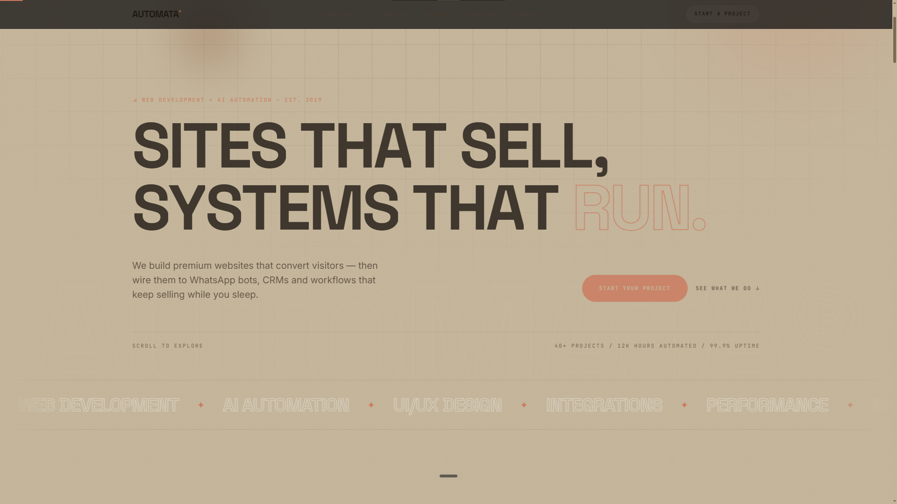
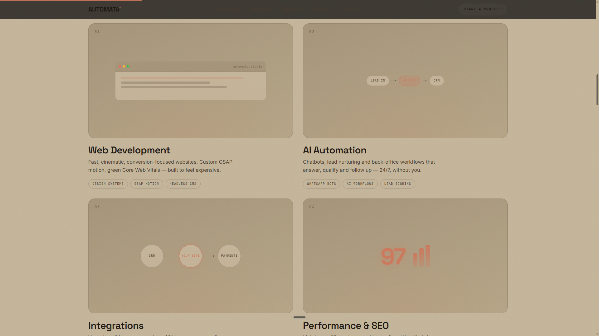
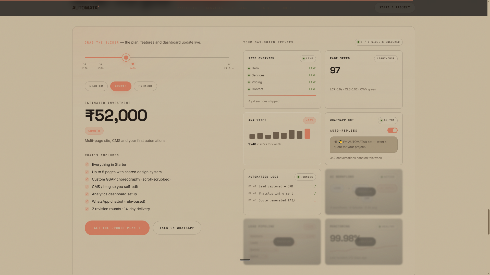

# AUTOMATA — Web Development & AI Automation Studio

A landing page concept for a studio that builds premium websites and wires them into automation — WhatsApp bots, CRMs, and workflows that keep running after the site ships.

🔗 **Live:** [REPLACE_WITH_ACTUAL_URL]

## Preview

*The landing hero — headline, CTA, and live stats.*

*Core services laid out as a 4-panel grid: Web Development, AI Automation, Integrations, Performance & SEO.*

*The interactive pricing slider next to a fake live dashboard — automation logs, WhatsApp bot status, analytics, all updating as you drag.*

## About

This started as a way to answer a question I kept getting from clients: "can the site actually *do* something after launch, not just sit there?" AUTOMATA is my take on that — a studio landing page that sells two things together instead of separately: a fast, well-built website, and the automation layer behind it (lead capture into WhatsApp, dashboards, workflow logs, that kind of thing).

## What's on the page

- **Services** — Web Development, AI Automation, Integrations, Performance & SEO, laid out as the core offering
- **Process section** — a "Discover → Design → Build → Automate" flow explaining how a project actually moves
- **Live dashboard mockup** — site overview, page speed, analytics, WhatsApp bot activity, automation logs, lead pipeline — built to *look* like a real ops dashboard a client would see post-launch
- **Pricing / plans** — tiered plans with an adjustable budget slider
- **Contact / CTA** — WhatsApp-first contact flow

## Built with

- HTML5, CSS3, JavaScript (vanilla)
- GSAP + ScrollTrigger for scroll-triggered animation
- Lenis for smooth scrolling
- Animated preloader, scroll progress bar

## Why I built it this way

Most agency landing pages stop at "here's our work." I wanted this one to demonstrate the automation side visually instead of just claiming it in a paragraph — hence the fake dashboard section with live-feeling widgets (automation logs, lead pipeline, WhatsApp bot status). It's the kind of thing that's easy to describe and hard to show, so I built a version you can scroll through and *see*.

## Running it locally
automate/
├── index.html
├── css/style.css
└── js/script.js    
Just clone and open `index.html` in a browser — no build step, no dependencies to install.

## Status

This is a demo/concept build — contact details and pricing on the page are placeholders, not a live business.